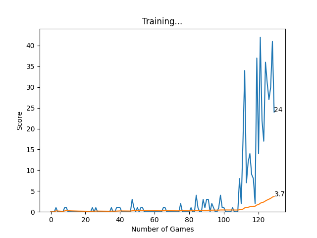

# RLSnake: Reinforcement Learning Snake AI

[](https://opensource.org/licenses/MIT)
[](https://www.python.org/)
[](https://pytorch.org/)
[](https://github.com/your-username/RLSnake)

This repository contains an advanced implementation of a Snake game AI agent trained using Reinforcement Learning with PyTorch. The project showcases how to develop an intelligent agent that learns to master the classic Snake game by optimizing its strategy to achieve high scores.

## ✨ Features

-   **Snake Game Environment**: A robust and customizable Snake game environment built with Pygame, designed for AI interaction.
-   **Deep Q-Network (DQN)**: Implements a Deep Q-Network, a powerful reinforcement learning algorithm, to enable the AI agent to learn optimal policies through experience.
-   **PyTorch Implementation**: Leverages the flexibility and power of PyTorch for efficient neural network model definition, training, and inference.
-   **Training and Evaluation**: Comprehensive scripts for training the AI agent from scratch, fine-tuning existing models, and evaluating its performance against human-like play.
-   **Visual Play**: Provides an option to visualize the AI playing the game in real-time, offering insights into its learned behavior.
-   **Automatic Model Saving**: The agent automatically saves its best-performing model, ensuring progress is preserved.
-   **Pre-trained Model Loading**: Ability to load previously trained models to continue training or for immediate deployment and evaluation.

## 🚀 Getting Started

### Prerequisites

Ensure you have the following installed on your system:

-   Python 3.8 or higher
-   `pip` (Python package installer)

### Installation

Follow these steps to set up the project locally:

1.  **Clone the repository**:
    ```bash
    git clone https://github.com/AneKazek/RLSnake.git
    cd RLSnake
    ```

2.  **Create a virtual environment** (recommended for dependency management):
    ```bash
    python -m venv rlsnake_env
    # On Windows:
    .\rlsnake_env\Scripts\activate
    # On macOS/Linux:
    source rlsnake_env/bin/activate
    ```

3.  **Install required dependencies**:
    ```bash
    pip install -r requirements.txt
    ```

### Running the AI Agent

To train the AI agent and watch it learn:

```bash
python notebooks/reinforcement_learning_pytorch_pygame/agent.py
```

To play the game manually and test your own skills:

```bash
python notebooks/reinforcement_learning_pytorch_pygame/snake_game_human.py
```

## 📂 Project Structure

```
RLSnake/
├── .gitignore
├── LICENCE.txt
├── README.md
├── requirements.txt
├── model/                  # Directory to store trained models
│   └── model.pth           # Saved PyTorch model
├── reports/                # Directory for generated reports and plots
│   └── Figure_1.png        # Example training plot
└── notebooks/
    └── reinforcement_learning_pytorch_pygame/
        ├── agent.py          # Main script for training the AI agent
        ├── game.py           # Snake game environment logic
        ├── model.py          # Deep Q-Network model definition
        ├── helper.py         # Utility functions (e.g., plotting)
        ├── snake_game_human.py # Script to play the game manually
        ├── arial.ttf         # Font file for Pygame
        └── LICENSE           # License for the original notebook
```

## 📈 Training Progress

An example of the training progress, showing the scores achieved over games:



## 📄 License

This project is licensed under the MIT License - see the `LICENCE.txt` file for details.

## 🙏 Acknowledgments

-   This project is inspired by various Reinforcement Learning tutorials and implementations of the Snake game.
-   Special thanks to the PyTorch and Pygame communities for their excellent libraries.
